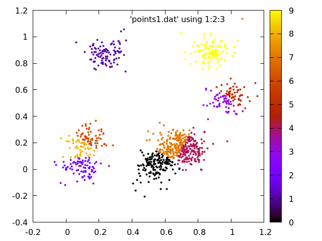
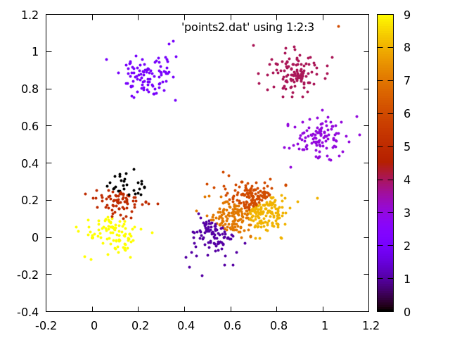

# K-means Clustering

## Compile
```bash
$ g++ main.cpp -std=c++11
```

## Run
```bash
$ ./a.out 1000 10 points1.dat points2.dat
```


## Graph
```bash
$ gnuplot plotboth.dem
```

## Plots done for random points

### K-MEANS


### K-MEANS++


LICENSE : [MIT](https://github.com/prateekkumarweb/K-means-cluster/blob/master/LICENSE)
